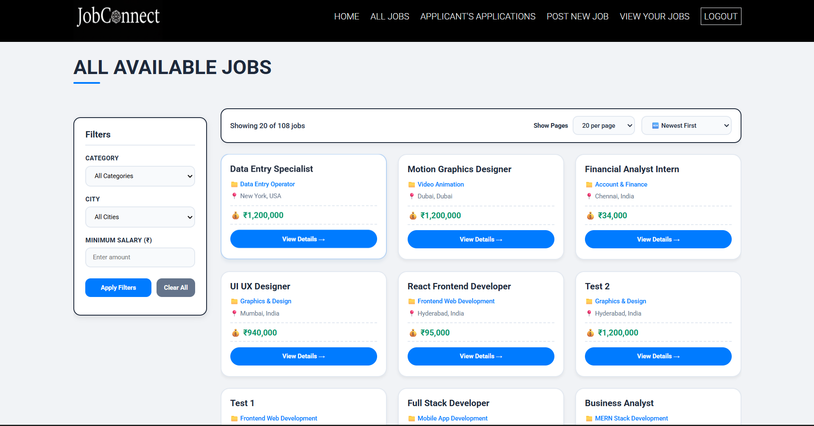
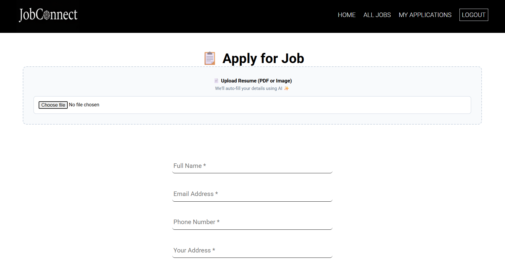
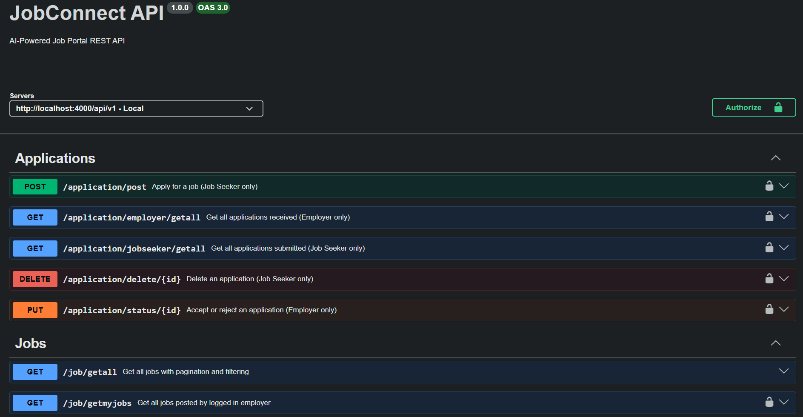
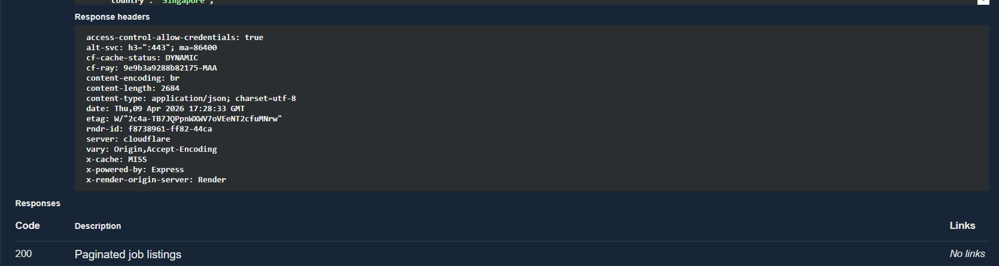

# JobConnect — AI-Powered Job Portal

> A production-ready recruitment SaaS platform built with TypeScript, Redis, Docker, and AI resume parsing.  
> 300ms API responses · AI resume parsing · Email notifications · Fully containerized

🔗 **Live Demo:** https://job-connect-2.vercel.app  
📖 **API Docs:** https://jc-backend-dxuw.onrender.com/api-docs

---



---

## What is JobConnect?

JobConnect is a full-stack job portal where employers post jobs and job seekers apply. Upload your resume as a PDF and the platform automatically extracts your name, email, phone, and skills using AI, filling in your application form in under 3 seconds. When an employer accepts or rejects an application, the job seeker gets an automated email instantly.

Built to demonstrate production-grade engineering: strict TypeScript, Redis caching, Docker, CI/CD, and OWASP-aligned security.

---

## Features

**TypeScript** — Full backend + frontend migration, strict mode, typed models and components.

**Redis Caching** — Cache-aside pattern, URL-based keys, 5min TTL. Response time dropped from 5s to 120ms.

**AI Resume Parser** — Upload PDF → Apilayer API extracts name, email, phone, skills → fallback to pdf-parse if API fails.



**Docker + Compose** — Multi-stage builds, Nginx reverse proxy, full stack runs with one command.

**RBAC** — Job Seeker / Employer / Admin roles, JWT middleware on every protected route.

**Zod Validation** — Schema validation on all POST/PUT endpoints before hitting the controller.

**Email Notifications** — Automated accept/reject emails via Nodemailer when employer updates application status.

**CI/CD** — GitHub Actions runs Jest tests on every PR, deploys on merge to main.

**Swagger / OpenAPI** — Auto-generated interactive API docs at `/api-docs`.

**Pagination + Filtering** — DB-level filtering by category, city, salary. Active filters sync to URL.

**Deployment** — Render (backend) + Vercel (frontend), cross-domain cookie auth configured.

---

## Tech Stack

**Backend:** Node.js · Express · TypeScript · MongoDB · Redis  
**Frontend:** React · TypeScript · Vite · Tailwind CSS  
**Services:** Apilayer (AI parser) · Nodemailer · Cloudinary  
**DevOps:** Docker · Nginx · GitHub Actions · Render · Vercel

---

## Architecture

```
┌──────────────┐      ┌────────────────┐      ┌────────────────┐
│  React +     │────▶ │  Nginx         │────▶ │  Express +     │
│  TypeScript  │      │  Reverse Proxy │      │  TypeScript    │
│  (Vercel)    │      │  /api/* → 4000 │      │  (Render)      │
└──────────────┘      └────────────────┘      └───────┬────────┘
                                                       │
                                        ┌──────────────┼──────────────┐
                                        ▼              ▼              ▼
                                   ┌─────────┐   ┌─────────┐   ┌───────────┐
                                   │ MongoDB │   │  Redis  │   │Cloudinary │
                                   └─────────┘   └─────────┘   └───────────┘
```

---

## Quick Start

### Docker (Recommended)

```bash
git clone https://github.com/Varuncc891/JobConnect_2
cd JobConnect_2
cp backend/.env.example backend/.env
# fill in your values
docker-compose up
```

### Manual

```bash
# Terminal 1 — Backend
cd backend && npm install && npm run dev

# Terminal 2 — Frontend
cd frontend && npm install && npm run dev
```

Requires MongoDB and Redis running locally.

---

## Environment Variables

`backend/.env`:

```env
MONGO_URI=your_mongodb_uri
JWT_SECRET_KEY=your_jwt_secret
JWT_EXPIRE=7d
COOKIE_EXPIRE=7
REDIS_URL=redis://localhost:6379
CLOUDINARY_CLOUD_NAME=your_cloud_name
CLOUDINARY_API_KEY=your_api_key
CLOUDINARY_API_SECRET=your_api_secret
APILAYER_API_KEY=your_apilayer_key
EMAIL_USER=your_gmail@gmail.com
EMAIL_PASS=your_gmail_app_password
FRONTEND_URL=http://localhost:3000
PORT=4000
```

`frontend/.env`:

```env
VITE_API_URL=http://localhost:4000
```

---

## API Docs

Interactive Swagger UI at `/api-docs`.





| Method | Endpoint | Auth | Description |
|--------|----------|------|-------------|
| POST | `/api/v1/user/register` | Public | Register a new user |
| POST | `/api/v1/user/login` | Public | Login and receive auth cookie |
| GET | `/api/v1/user/logout` | Authenticated | Logout and clear auth cookie |
| POST | `/api/v1/job/post` | Employer | Post a new job |
| GET | `/api/v1/job/getall` | Public | Get all jobs with pagination and filtering |
| GET | `/api/v1/job/getmyjobs` | Employer | Get jobs posted by logged-in employer |
| GET | `/api/v1/job/{id}` | Public | Get a single job by ID |
| PUT | `/api/v1/job/update/{id}` | Employer | Update a job |
| DELETE | `/api/v1/job/delete/{id}` | Employer | Delete a job |
| POST | `/api/v1/application/post` | Job Seeker | Apply for a job |
| GET | `/api/v1/application/employer/getall` | Employer | Get all received applications |
| GET | `/api/v1/application/jobseeker/getall` | Job Seeker | Get all submitted applications |
| PUT | `/api/v1/application/status/{id}` | Employer | Accept or reject an application |
| DELETE | `/api/v1/application/delete/{id}` | Job Seeker | Delete an application |
| POST | `/api/v1/resume/parse` | Authenticated | Parse resume PDF and extract data |

---

## Testing

```bash
cd backend
npm test               # run all tests
npm test -- --coverage # with coverage
```

20+ tests covering Zod schemas, utility functions, and middleware.

**picture 3: screenshot of GitHub Actions showing a passing workflow run**

---

## Security

**Authentication** — JWTs stored in `httpOnly` cookies, inaccessible to JavaScript. Passwords hashed with bcrypt (10 rounds), never stored in plaintext.

**Authorization** — RBAC middleware on every protected route. Wrong role returns 403.

**Input Validation** — Zod schemas on all POST/PUT endpoints. Rejects malformed input before it reaches the database.

**Rate Limiting** — `express-rate-limit` configured on all `/api/` routes. 100 requests per 15 minutes per IP.

**CORS** — Explicit `origin: process.env.FRONTEND_URL`, no wildcard.

**Secrets** — All credentials in environment variables, never in source code. `.env` is in `.gitignore`.

| OWASP Risk | Mitigation |
|------------|------------|
| A01 Broken Access Control | RBAC middleware on all protected routes |
| A02 Cryptographic Failures | bcrypt, HTTPS in production |
| A03 Injection | Zod validation, Mongoose parameterized queries |
| A05 Security Misconfiguration | CORS whitelist, secrets in env vars |
| A07 Auth Failures | httpOnly cookies, JWT expiry, bcrypt |

---

## Project Structure

```
JobConnect_2/
├── backend/src/
│   ├── config/        # DB, Redis, Swagger
│   ├── controllers/   # Route handlers
│   ├── middleware/    # Auth, RBAC, cache, validate
│   ├── models/        # Mongoose + TypeScript interfaces
│   ├── routes/        # Express routers + Swagger JSDoc
│   ├── services/      # AI parser, email
│   ├── utils/         # AppError, catchAsync, sendToken
│   └── validators/    # Zod schemas
├── frontend/src/
│   ├── components/
│   ├── hooks/
│   └── utils/         # Axios API instance
├── .github/workflows/ # CI/CD
└── docker-compose.yml
```
